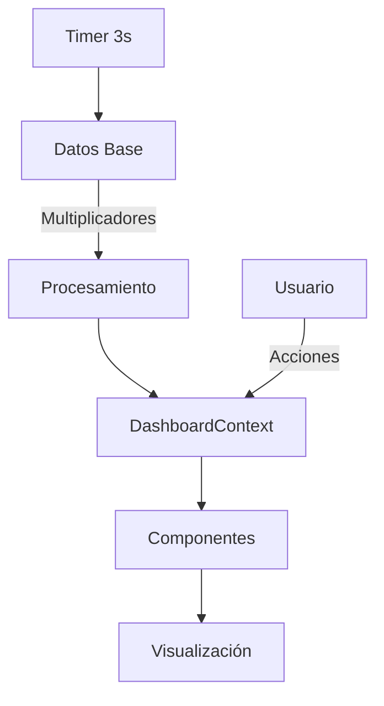

# 📊 Dashboard de Monitoreo Hidrológico - Río Claro, Pucón

## 🎯 Descripción del Proyecto

Sistema de monitoreo en tiempo real para análisis hidrológico del Río Claro en Pucón, Chile. Este dashboard profesional muestra métricas de flujo, nivel, caudal y velocidad del agua desde múltiples estaciones de monitoreo.

## 🏗️ Arquitectura del Proyecto

```
src/
├── 📁 components/          # Componentes de React organizados por funcionalidad
│   ├── 📁 alerts/         # Sistema de alertas hidrológicas  
│   ├── 📁 charts/         # Gráficos y visualizaciones
│   ├── 📁 dashboard/      # Componentes del dashboard principal
│   ├── 📁 layout/         # Estructura y layout de la aplicación
│   ├── 📁 maps/           # Mapas interactivos con Leaflet
│   ├── 📁 reports/        # Generador de reportes técnicos
│   └── 📁 ui/             # Componentes de interfaz reutilizables
│
├── 📁 config/             # Configuración centralizada
│   └── 📄 constants.ts    # 🔧 TODAS las constantes hardcodeadas
│
├── 📁 contexts/           # Estado global con React Context
│   └── 📄 DashboardContext.tsx  # Estado principal del dashboard
│
├── 📁 hooks/              # Custom hooks reutilizables
│   ├── 📄 useOptimizedData.ts   # Optimización de datos
│   ├── 📄 useReports.ts         # Generación de reportes
│   └── 📄 useTheme.ts           # Manejo de temas
│
├── 📁 types/              # Definiciones de TypeScript
│   ├── 📄 index.ts        # Tipos principales
│   └── 📄 reports.ts      # Tipos para reportes
│
├── 📁 utils/              # Utilidades y funciones auxiliares
│   ├── 📄 chartUtils.tsx  # Utilidades para gráficos
│   ├── 📄 mapUtils.ts     # Utilidades para mapas
│   └── 📄 metricUtils.ts  # Procesamiento de métricas
│
└── 📄 main.tsx            # Punto de entrada de la aplicación
```

## 🔧 Valores Hardcodeados (Para Modificar)

### 📍 Ubicación: `src/config/constants.ts`

```typescript
// 🔧 CONFIGURACIÓN PRINCIPAL
export const APP_CONFIG = {
  updateInterval: 3000,  // Actualización cada 3 segundos
  // ⬆️ Cambiar para modificar frecuencia de datos
};

// 🔧 MULTIPLICADORES DE DATOS
export const VISUAL_CONFIG = {
  multipliers: {
    flujo: { station1: 1.2, station2: 1.1 },     // Simular diferencias entre estaciones
    nivel: { station1: 1/50, station2: 1/48 },   // Convertir a metros reales
    caudal: { station1: 15, station2: 14 },      // Convertir a L/s realistas
    velocidad: { station1: 1/60, station2: 1/58 } // Convertir a m/s realistas
    // ⬆️ Modificar estos valores para ajustar las métricas mostradas
  }
};

// 🔧 RANGOS TEMPORALES
export const TIME_RANGES = {
  '30m': { minutes: 30, label: 'Últimos 30 minutos' },
  '1h': { minutes: 60, label: 'Última hora' },
  // ⬆️ Agregar/quitar rangos según necesidades
};
```

### 📍 Ubicación: `src/contexts/DashboardContext.tsx`

```typescript
// 🔧 ESTADO INICIAL
const initialState = {
  selectedMetric: 'flujo',    // Métrica inicial mostrada
  timeRange: '30m',           // Rango temporal por defecto
  // ⬆️ Cambiar valores iniciales del dashboard
};
```

## 📊 Métricas Monitoreadas

### 1. 💧 **Flujo** (m³/s)
- **Descripción**: Volumen de agua que pasa por segundo
- **Estación 1**: Multiplicador 1.2 (simula río arriba)
- **Estación 2**: Multiplicador 1.1 (simula río abajo)

### 2. 📏 **Nivel** (metros)
- **Descripción**: Altura del agua sobre punto de referencia  
- **Conversión**: Divide valores grandes por 50/48
- **Uso**: Detectar riesgo de desborde

### 3. 🌊 **Caudal** (L/s)
- **Descripción**: Cantidad de agua que fluye
- **Conversión**: Multiplica por 15/14 para valores realistas
- **Importancia**: Gestión de recursos hídricos

### 4. ⚡ **Velocidad** (m/s)
- **Descripción**: Velocidad del agua
- **Conversión**: Divide por 60/58 para obtener m/s
- **Alerta**: Velocidad alta = mayor poder erosivo

## 🎨 Sistema de Colores

```css
/* 🔧 PALETA PRINCIPAL - Cambiar en src/index.css */
:root {
  --primary: #06B6D4;      /* Turquesa principal */
  --primary-dark: #0891B2;  /* Turquesa oscuro */  
  --alert-high: #EF4444;    /* Rojo para alertas */
  --alert-medium: #F59E0B;  /* Ámbar para advertencias */
  --alert-low: #10B981;     /* Verde para normal */
}

/* Colores de estaciones */
.station1 { color: #34d399; } /* Verde esmeralda */
.station2 { color: #38bdf8; } /* Azul cielo */
```

## ⚙️ Configuración de Desarrollo

### 🚀 Ejecutar el Proyecto

```bash
# Instalar dependencias
npm install

# Ejecutar en desarrollo (puerto 5174)
npm run dev

# Construir para producción
npm run build
```

### 📦 Tecnologías Utilizadas

- **React 18.3.1** - Framework principal
- **TypeScript** - Tipado estático
- **Tailwind CSS** - Estilos utilitarios
- **Recharts** - Gráficos interactivos
- **Leaflet** - Mapas interactivos
- **Framer Motion** - Animaciones
- **Date-fns** - Manejo de fechas

## 🔄 Flujo de Datos



1. **Generación**: Datos base simulados cada 3 segundos
2. **Procesamiento**: Aplicación de multiplicadores realistas
3. **Estado Global**: Almacenado en DashboardContext
4. **Distribución**: A todos los componentes via Context
5. **Visualización**: Gráficos, métricas y mapas

## 🚨 Sistema de Alertas

### Niveles de Alerta (automáticos):

- 🔴 **CRÍTICO**: Desborde inminente (rojo pulsante)
- 🟠 **ALTO**: Superación de umbrales (naranja)  
- 🟡 **MEDIO**: Tendencias anómalas (amarillo)
- 🔵 **INFO**: Mantenimiento (azul)

### 🔧 Personalizar Umbrales:

Ubicación: `src/components/alerts/` 
- Modificar valores en funciones de detección
- Ajustar colores y comportamientos

## 📋 Reportes Técnicos

### Tipos Disponibles:

1. **Reporte Diario Operacional**
   - Resumen de últimas 24h
   - Métricas principales
   - Estado de sensores

2. **Análisis de Evento Extremo**  
   - Para eventos críticos
   - Análisis de impacto
   - Plan de mitigación

3. **Informe Mensual Estadístico**
   - Estadísticas completas
   - Percentiles y promedios
   - Análisis de tendencias

4. **Reporte de Mantenimiento**
   - Estado de equipos
   - Calibraciones
   - Cronograma preventivo

## 🛠️ Guía de Personalización

### ✏️ Cambiar Nombres de Estaciones:

```typescript
// 📍 src/config/constants.ts
export const TEXTOS_INTERFACE = {
  estaciones: {
    station1: 'Puente Los Arrayanes',  // 🔧 Cambiar aquí
    station2: 'Desembocadura Lago',    // 🔧 Cambiar aquí
  }
};
```

### 🎯 Modificar Métricas:

```typescript
// 📍 src/config/constants.ts  
multipliers: {
  flujo: { 
    station1: 1.5,  // 🔧 Aumentar diferencia
    station2: 0.8   // 🔧 Nueva proporción
  }
}
```

### 🕒 Cambiar Intervalos:

```typescript
// 📍 src/config/constants.ts
APP_CONFIG = {
  updateInterval: 5000  // 🔧 5 segundos en lugar de 3
};
```

## 🐛 Solución de Problemas

### ❌ Error: "useDashboard must be used within a DashboardProvider"
**Solución**: Asegurar que el componente esté dentro de `<DashboardProvider>`

### 🗺️ Mapa no se visualiza correctamente  
**Solución**: Verificar que Leaflet CSS se importe ANTES de Tailwind

### 📊 Gráficos no muestran datos
**Solución**: Verificar multiplicadores en `VISUAL_CONFIG`

### ⏱️ Datos no se actualizan
**Solución**: Revisar `updateInterval` en `APP_CONFIG`

## 📧 Contacto y Soporte

Para modificaciones específicas o dudas técnicas:

1. **Configuración**: Revisar `src/config/constants.ts`
2. **Estados**: Revisar `src/contexts/DashboardContext.tsx` 
3. **Estilos**: Revisar `src/index.css`
4. **Componentes**: Cada carpeta en `src/components/`

---

**🎯 Objetivo**: Dashboard profesional para monitoreo hidrológico en tiempo real del Río Claro, con alertas inteligentes y reportes técnicos automáticos.